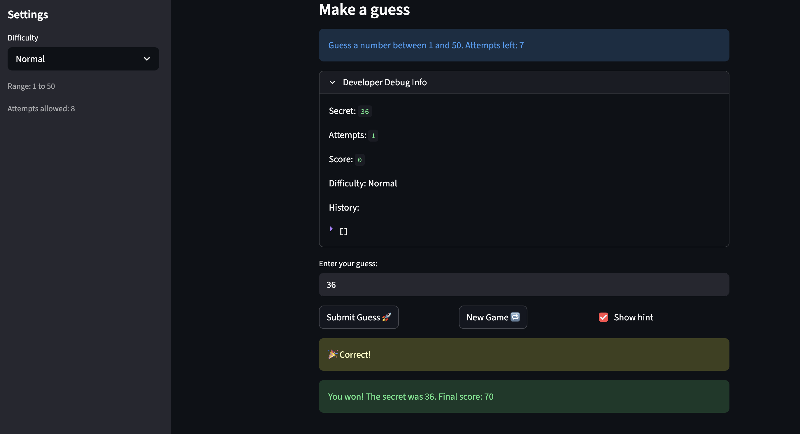
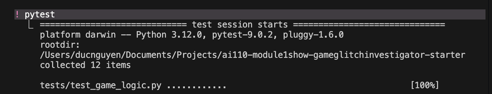

# 🎮 Game Glitch Investigator: The Impossible Guesser

## 🚨 The Situation

You asked an AI to build a simple "Number Guessing Game" using Streamlit.
It wrote the code, ran away, and now the game is unplayable. 

- You can't win.
- The hints lie to you.
- The secret number seems to have commitment issues.

## 🛠️ Setup

1. Install dependencies: `pip install -r requirements.txt`
2. Run the broken app: `python -m streamlit run app.py`

## 🕵️‍♂️ Your Mission

1. **Play the game.** Open the "Developer Debug Info" tab in the app to see the secret number. Try to win.
2. **Find the State Bug.** Why does the secret number change every time you click "Submit"? Ask ChatGPT: *"How do I keep a variable from resetting in Streamlit when I click a button?"*
3. **Fix the Logic.** The hints ("Higher/Lower") are wrong. Fix them.
4. **Refactor & Test.** - Move the logic into `logic_utils.py`.
   - Run `pytest` in your terminal.
   - Keep fixing until all tests pass!

## 📝 Document Your Experience

**Game purpose:** A number guessing game where the player picks a difficulty, gets a limited number of attempts to guess a secret number, and receives higher/lower hints after each guess. Score is tracked across attempts.

**Bugs found:**
1. **Inverted hints** — guessing below the secret showed "Go LOWER", guessing above showed "Go HIGHER". Root cause: `app.py` was converting the secret to a string on every even-numbered attempt, causing Python to compare lexicographically instead of numerically (`"3" > "50"` is `True`).
2. **Swapped difficulty ranges** — Normal was `1–100` and Hard was `1–50`, meaning Hard was actually easier than Normal. Fixed by swapping the return values in `get_range_for_difficulty`.
3. **Negative scores** — wrong guesses could push the score below zero. Fixed by wrapping subtractions in `max(0, ...)`.
4. **New game did not reset state** — clicking New Game left the old status and history in `st.session_state`, so the game was still marked as won/lost. Fixed by also resetting `status` and `history` in the new-game handler.
5. **History grew across games** — the guess history list was never cleared between games, so it kept accumulating. Fixed alongside the new-game state reset.

**Fixes applied:**
- Removed the even-attempt `str()` coercion in `app.py` so `check_guess` always receives an integer secret.
- Corrected Normal → `1–50` and Hard → `1–100` in `logic_utils.get_range_for_difficulty`.
- Added `max(0, ...)` floor to both penalty branches in `update_score`.
- Added `st.session_state.status = "playing"` and `st.session_state.history = []` to the new-game handler.
- Refactored all game logic (`get_range_for_difficulty`, `parse_guess`, `check_guess`, `update_score`) from `app.py` into `logic_utils.py`.
- Added `conftest.py` so pytest can find `logic_utils` from the `tests/` subdirectory.
- Wrote targeted regression tests for each bug in `tests/test_game_logic.py`.

## 📸 Demo

- [x] [Insert a screenshot of your fixed, winning game here]

## 🧪 pytest Results (Challenge 1)

- [x] [Insert a screenshot of your pytest terminal output showing all tests passing here]

## 🚀 Stretch Features

- [ ] [If you choose to complete Challenge 4, insert a screenshot of your Enhanced Game UI here]
